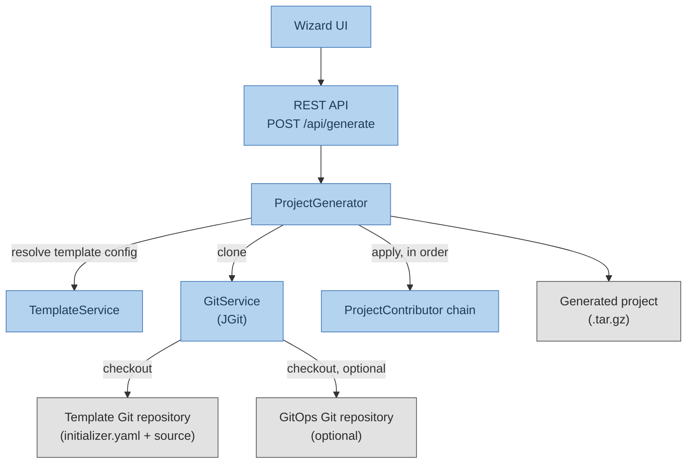

# Architecture

## Overview

The jEAP Initializer is a single Spring Boot application (module `jeap-initializer`) that, given a template key
and a set of parameters, clones a template Git repository, applies a chain of transformations to it, and returns
the result as a downloadable archive. There is no persistent generated-project state: each request works in a
temporary directory that is discarded after the response is sent.

## Generation flow

`ProjectGenerator.generate(...)` is the central orchestration point:

1. Look up the requested template's configuration via `TemplateService` / `TemplateRepository`.
2. Validate the request: required template parameters are present (`TemplateParameterMissingException` otherwise),
   selected module ids exist (`TemplateModuleNotFoundException` otherwise), and required module parameters are
   present.
3. Clone the template's `repository-configuration` into a temporary local path using `GitService` (JGit-based).
4. If a `git-ops-repository-configuration` is set, clone it into a `gitops/` subdirectory of the same temp path.
5. Run every registered `ProjectContributor` bean, in ascending `getOrder()` value (Spring's `Ordered` contract —
   lower values run first).
6. Initialize a fresh Git repository in the generated project directory with a single "Initial commit".
7. The caller (`InitializerController`) tar-gzips the directory and streams it back as the HTTP response.

## Contributors

Contributors implement `ProjectContributor#contribute(Path projectRoot, ProjectRequest projectRequest,
ProjectTemplate template)` and are auto-discovered as Spring beans; `ProjectGenerator` receives the full list and
runs them by `getOrder()`. This makes the pipeline extensible — see [Extending](extending.md) for adding your own.

Built-in contributors, in the order they run (`getOrder()` value in parentheses; unlisted contributors use the
default `Ordered.LOWEST_PRECEDENCE` and run last):

| Contributor                         | Order                        | Purpose                                                                                     |
|--------------------------------------|-------------------------------|-----------------------------------------------------------------------------------------------|
| `TemplateModuleContributor`          | `HIGHEST_PRECEDENCE + 5`      | Removes code/files belonging to unselected optional modules; strips markers of selected ones. |
| `ParameterReplacementContributor`    | `HIGHEST_PRECEDENCE + 10`     | Replaces `INITIALIZER PARAMETER <name> VALUE <value>`-declared placeholders in source files.  |
| `ApplicationNameContributor`         | `HIGHEST_PRECEDENCE + 20`     | Replaces the template's application name with the requested one in `README.md`/`index.html`.  |
| `ArtifactIdContributor`              | `HIGHEST_PRECEDENCE + 20`     | Renames module folders and replaces the artifact id in POMs, Jenkinsfiles, Dockerfiles, Angular/UI config files. |
| `FolderRenamerContributor`           | `HIGHEST_PRECEDENCE + 50`     | Moves Java source folders from the template's base package path to the requested base package path. |
| `PropertyFilesContributor`           | `HIGHEST_PRECEDENCE + 100`    | Replaces system name, artifact id and context path in `application*.yml/yaml/properties`/`environment*.ts`. |
| `GroupIdRenamerContributor`          | default (last)                | Replaces the Maven `<groupId>` in `pom.xml` files.                                            |
| `JavaPackageRenamerContributor`      | default (last)                | Replaces the base package in all `.java` files and IntelliJ run configurations.               |
| `CodeRemoverContributor`             | default (last)                | Removes `START/END INITIALIZER DELETE` marked blocks from any source file.                    |
| `TemplateFileRemovalContributor`     | default (last)                | Deletes the template's `initializer.yaml` metadata file.                                      |
| `TemplateFileRenamingContributor`    | default (last)                | Renames `*.initializer-template` files to their real name (for formats that can't use comment markers, e.g. JSON). |

`TemplateModuleContributor` internally reuses `CodeRemoverContributor` with a module-specific block name (`MODULE
<id>`) to remove code for modules that were not selected, and deletes files marked with `MODULE-SPECIFIC FILE FOR
MODULE <id>`.

## Key classes

| Class                         | Responsibility                                                                              |
|---------------------------------|-----------------------------------------------------------------------------------------------|
| `Application`                 | Spring Boot entry point; excludes `UserDetailsServiceAutoConfiguration` (no user login).       |
| `JeapInitializerProperties`   | `@ConfigurationProperties` for `jeap.initializer.*`; validates platforms/templates on startup. |
| `ProjectTemplate`              | Runtime model of a configured template: repos, base package, parameters, optional modules.     |
| `Platform`                     | Optional grouping used to categorize templates in the wizard UI.                              |
| `ProjectGenerator`             | Orchestrates cloning + contributor chain + Git re-init, described above.                        |
| `GitService` / `DefaultGitService` | JGit-based cloning of template and GitOps repositories.                                    |
| `TemplateService` / `TemplateRepository` / `CachingTemplateRepository` | Resolve configured templates/platforms; cache the parsed `ProjectTemplate`. |
| `InitializerController`       | REST endpoint `POST /api/generate`; returns the generated project as a `.tar.gz` stream.       |
| `WizardController` / `FrontendController` | Server-rendered wizard UI backing the same generation flow.                        |

## See also

- [Getting Started](getting-started.md) — how to configure and call the initializer
- [Configuration](configuration.md) — full property reference
- [Template Authoring](template-authoring.md) — writing `initializer.yaml`, module/parameter markers
- [Extending](extending.md) — adding custom `ProjectContributor` beans
